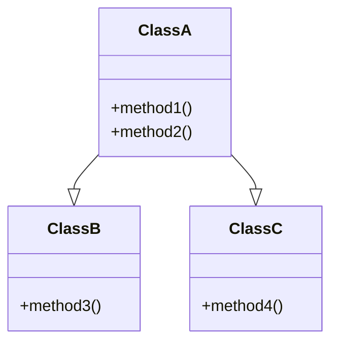

```mermaid
classDiagram
    ClassA --|> ClassB
    ClassA --|> ClassC
    class ClassA {
        +method1()
        +method2()
    }
    class ClassB {
        +method3()
    }
    class ClassC {
        +method4()
    }
```

$x ^ 2 + 7x + 6 = (x + 1) (x + 6)$
